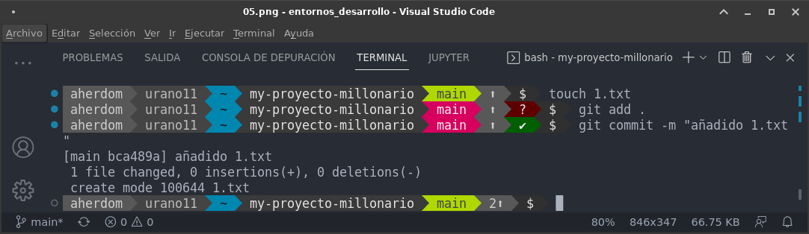

# Tarea 6.- Manipulación Avanzada en Git (trabajo con tags y ramas) 

* Autor: Antonio Hernández Domínguez
* Curso: 1º DAW 2022/2023
* Asignatura: Entornos de desarrollo
* Tema 2: Documentación y Sistemas de control de versiones
***

<div align="justify">

# Indice

## [1. Introducción](#id0)
## [2. Creamos el repositorio "My-proyecto-millonario"](#id1)
## [3. Ignorar archivos](#id2)
## [4. Crear etiquetas](#id3)
## [5. Mezlcado de ramas](#id4)
## [6. Arreglar conflictos](#id5)

***

## 1. Introducción <a name="id0"></a>

Trabajaremos en esta tarea otras características del control de versiones "Git", donde aprenderemos principalmente a:

- Ignorar ficheros en cuanto a la gestión de los diversos cambios que se den en ellos.

- La creación de etiquetas que nos faciliten el "versionado" de nuestro producto en desarrollo.

- La resolución de conflictos entre elementos que se han versionado y que al momento de mezclarlos existen colisiónes entre las distintas versiones de un mismo elemento.

## 2. Creamos el repositorio "My-proyecto-millonario" <a name="id1"></a>

Crear un repositorio en vuestro GitHub llamado **my-proyecto-millonario**.

Clonar vuestro repositio en local.

~~~
git clone git@github.com:alumno-XXX/my-proyecto-millonario.git
~~~


## README

Crear (si no lo habéis creado ya) en vuestro repositorio local
un documento **README.md**.


> Notas: en este documento tendreís que ir poniendo los **comandos**
> que habéis tenido que utilizar durante todos los ejercicios
> y las **explicaciones y capturas de pantalla** que consideréis **necesarias**.

~~~
cat > README.md
~~~


## Commit inicial

Añadir al README.md los comanddos utilizados hasta ahora
y hacer un coomit inicial con el mensaje **commit inicial**.

~~~
git add .
git commit -m "commit inicial"
~~~


## Push inicial

Subir los cambios al repositorio remoto.

~~~
git push origin master/main
~~~


***
> Pregunta: Si has clonado el repositorio que parte del comando anterior puedo omitir. Justifica tu respuesta en el fichero **README.md**.

Dado que el repositorio lo hemos creado desde la plataforma "GitHub" y lo hemos clonado a local, cuando realizamos el "git push" no es necesario emplear seguido de este los parámetros "origin <rama>" ya que el repositorio ya existía en GitHub.

Si el repositorio lo hubiesemos creado en local y luego realizáramos el "push" inicial sí habría que emplear todo el comando.

***

## 3. Ignorar archivos <a name="id2"></a>

### Ignorar archivos

Crear en el repositorio local un fichero llamado **privado.txt**.

~~~
touch privado.txt
~~~

Crear en el repositorio local una carpeta llamada **privada**.

~~~
mkdir privada
~~~

Realizar los cambios oportunos para que tanto el archivo como
la carpeta sean ignorados por git.

~~~
echo "privado.txt" >> .gitignore
echo "/privada" >> .gitignore
git add .
git commit -m "añadido fichero .gitignore"
~~~


***
> Preunta: el fichero y el directorio privado debe de subir al repositorio si se encuentra añadido al fichero .gitingnore. **[Si/No]**. Justifica tu respuesta en el fichero **README.md**.

No, dado que el fichero ".gitignore" filtra los elementos de nuestro repositorio de manera que los que se incluyan en él se excluirán del versionado. Le decimos a "Git" que no queremos gestionar los cambios de estos ficheros.

***

## Añadir fichero 1.txt

1. Añadir fichero **1.txt** al repositorio local.

~~~
touch 1.txt
git add .
git commit -m "añadido 1.txt"
~~~



***
> Preunta: Si ejecutado las acciones add y commit, que realiza cada una sobre el/los ficheros. Justifica tu respuesta en el fichero **README.md**.

El comando ```git add .``` añade a nuestra zona de intercambio TODOS los ficheros contenidos en nuestro repositorio local y carpeta "my_proyecto-millonario".

Una vez han sido añadidos a dicha zona de intercambio, confirmamos sus cambios y el versionado de los mismos con el comando ```git commit```, quedando a un comando ["git push"] de ser subidos a nuestro repositorio remoto y origen del local.

***
## 4. Crear etiquetas <a name="id3"></a>

### Crear el tag v0.1

1. Crear un tag **v0.1**.

~~~
git tag v0.1
~~~

## Subir el tag v0.1

1. Subir los cambios al repositorio remoto.

~~~
git push --tag origin master
~~~


***
> Preunta: *¿Qué es un tag sobre un repositorio git, en nuestro caso Github?.* Justifica tu respuesta en el fichero **README.md**.

Un "tag" es una etiqueta que nos sirve para gestionar los distintos elementos de nuestro repositorio de manera que referenciemos - mediante etiquetas - dichos elementos que tengan relación entre sí y que estructuren de forma lógica y eficiente tanto las versiones como las ramas de dichos elementos.

***

## Crear una rama v0.2

1. Crear una rama **v0.2**.

~~~
git branch v0.2
~~~

1. Posiciona tu carpeta de trabajo en esta rama.

~~~
git checkout v0.2
~~~

## Añadir fichero 2.txt

1. Añadir un fichero **2.txt** en la rama **v0.2**.

~~~
touch 2.txt
git add .
git commit -m "añadido 2.txt"
~~~

***
> Preunta: *Cuando estamos trabajando con ramas, cual es su fin, y sentido en organizaciones pequeñas/medianas/grandes.* Justifica tu respuesta en el fichero **README.md**.
***

## Crear rama remota v0.2

1. Subir los cambios al reposiorio remoto.

~~~
git push origin v0.2
~~~

## 5. Mezclado de ramas <a name="id4"></a>

## Merge directo

1. Posicionarse en la rama **master/main** según sea tu rama principal.

~~~
git checkout master
~~~

1. Hacer un merge de la rama **v0.2** en la rama **master/main**.

~~~
git merge v0.2 -m "merge v0.2 sin conflictos"
~~~

***
> Preunta: *Se tendrían que producir conflictos en esta acción.* **[Si/No]** Justifica tu respuesta en el fichero **README.md**.
***

## Merge con conflicto

1. En la rama **maste/main** poner **Hola** en el fichero **1.txt** y hacer commit.

~~~
git checkout master
echo "Hola" >> 1.txt
git add .
git commit -m "hola en 1.txt"
~~~

1. Posicionarse en la rama **v0.2** y poner **Adios** en el fichero "1.txt" y hacer commit.

~~~
git checkout v0.2
echo "Adios" >> 1.txt
git add .
git commit -m "adios en 1.txt"
~~~

1. Posicionarse de nuevo en la rama **master/main** y hacer un merge con la rama **v0.2**

~~~
git checkout master
git merge v0.2
vim 1.txt
git add .
git commit -m "arreglado merge en 1.txt"
~~~

## Listado de ramas

1. Listar las ramas con merge y las ramas sin merge.

~~~
git branch --merged
git branch --no-merged
~~~

***

## 6. Arreglar conflictos <a name="id5"></a>

## Arreglar conflicto

1. Arreglar el conflicto anterior y hacer un commit.

~~~
vim 1.txt
git add .
git commit -m "arreglado merge en 1.txt"
~~~

## Borrar rama

1. Crear un tag **v0.2**

~~~
git tag v0.2
~~~

1. Borrar la rama **v0.2**

~~~
git branch -d v0.2
~~~

## Listado de cambios

1. Listar los distintos commits con sus ramas y sus tags.

~~~
git config --global alias.list 'log --oneline --decorate --graph --all'
git list
~~~

***
</div>

